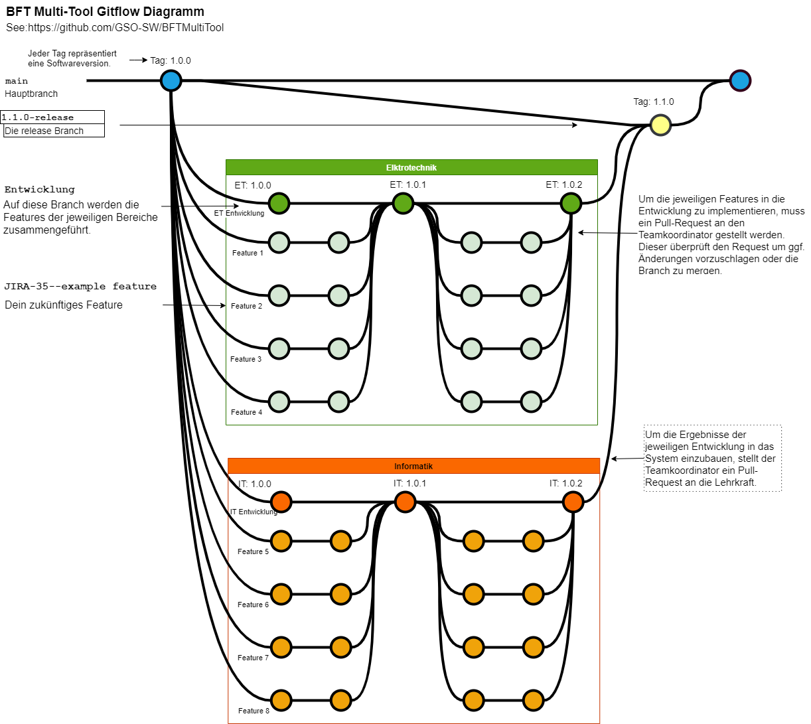

# BFTMultiTool
Die Schüler der Klasse BFT11 wurden damit beauftragt eine Multi-Tool Software zu erstellen, welche allen kommenden Berufsfachschülern aus dem Bereich Technik als Hilfsmittel dienen soll, um ihren Schulabschluss erfolgreich zu meistern. Hierbei sollen wiederkehrende oder besonders aufwendige Aufgaben aus dem schulischen Kontext erleichtert oder gelöst werden. Diese Aufgaben ergeben sich aus den Problemstellungen der Unterrichtseinheiten der Berufsfachschule für Technik. 

Das Projekt ist in die Bereiche Mathematik, Elektrotechnik… aufgeteilt. Diese Bereiche orientieren Sich an den Naturwissenschaftlichen Unterrichtsfächern der Berufsfachschule. Die nachfolgende Tabelle zeigt welche Features in den einzelnen Bereichen umgesetzt werden.

***Die Teamkoordinatoren können direkt in die jeweilige Entwicklungs-Branch schreiben. Die Entwickler müssen ein Pull-Request bei den jeweiligen Koodrinatoren stellen*** 

| Bereich     	| Feature 	|Rolle		|Name		|Username	|Branch		|
| ----------- 	| ----------- 	|-----------	|-----------	|-----------	|-----------	|
|**Administration**	|Release      	|Administrator	|Kander Akinci 	|AI-Assistant	|Release, main	|
|		|	|		|		|		|		|		|
|**Elektrotechnik**	|Menü ET / Spannung als Energieaufteilung & Strom aus Ladungen je Zeit|Teamkoordinator|David Schaele|DavidCXV|ETEntwicklung,Feature1|
|   		|Spannungsfall & Leitungsquerschnitt berechnen |Entwickler|Nicolai Mockenhaupt	|NeoEkusoshisuto|Feature2|
|   		|Ohm'schesGesetz & Leistungsgesetz |Entwickler|Nico Billig	|Nico-GSO|Feature3|
|   		|Widerstand, Kondensator & Spule Info und Berechnung|Entwickler|David Waderna|Davobeats|Feature4|
|		|	|		|		|		|		|		
|**Physik**	|Menü PY /Vorsätze für Maßeinheiten umwandeln SI –Einheiten umrechnen	|Teamkoordinator|Jonas Högele	|Jonashgl|PHEntwicklung	,Feature5|
|		|Schwerkraft –Vergleichzu anderen Planeten, Allg,Schwerkraftberechnen|	Entwickler	|Arad Ahmen|arad021	|	Feature6|		
|		|	|	Entwickler	|Tobias Cremer	|TobiasC53		|	Feature7|
|		|Volumen von Würfel, Kugel, Pyramide und Prisma|Entwickler	|Jowan Hamko|jowanh2|Feature8|
|		|	||||		|		
|**Informatik**	|Menü IT / Zahlensysteme ineinander umrechnen|Teamkoordinator|Haitam Kazzaz	|Haitham2004|ITEntwicklung,Feature9|				
|		|	|Entwickler	|	Emre-Can Zeren	|EmreZ55	|Feature10|		
|		|	|	Entwickler|Mansour Alassaf	|mansourr23	|Feature11|	
|		|	|	|		|		|		|		
|**Wirtschaft**	|	|Teamkoordinator|Florian Reuter	|Florian116	|WIEntwicklung,Feature12|				
|		|	|		|Tamim Hashimi|	Tamim-2003|Feature13|		
|		|	|		|Murtaza Behzad|		|Feature14|		
|		|	|		|Deniz Kartal|	DenizDRoger|Feature15|	
|		|	|		|		|		|		|	
|**Mathematik**	|Menü MT / ... |Teamkoordinator|Moritz Mersmann|MoritzM1110|MAEntwicklung,Feature16|				
|		|Funktionsgleichung, Nullstellen und Funktionswerte von Lineare Funktionen berechnen|	Entwickler	|Dennis Jakob	|Dennis180|Feature17|		
|		|	|	Entwickler	|Deniz Kest |	DenoDenoDeno123454321|Feature18|		
|		|Flächenberechnung verschiedener Formen|	Entwickler	|	Samir Yusuf	|	AugeRaus	|Feature19|		
				
				

